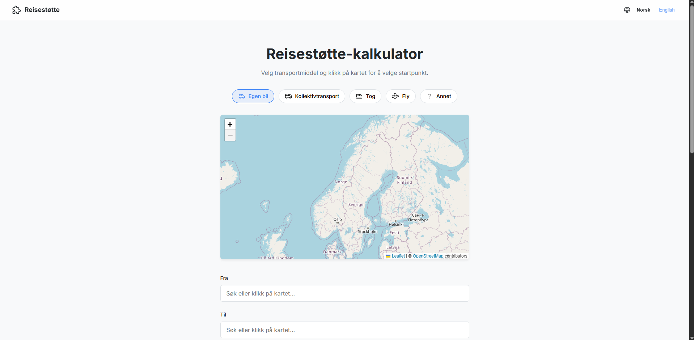
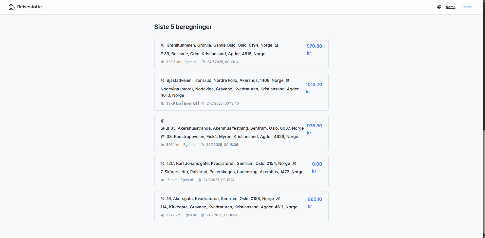
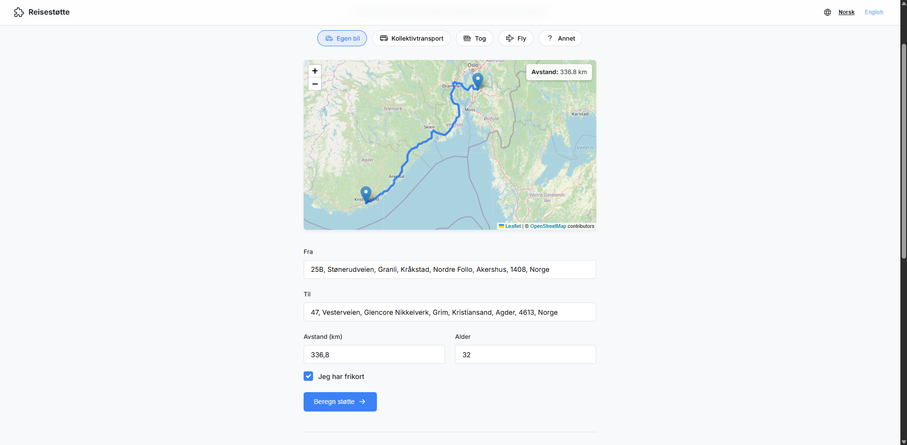
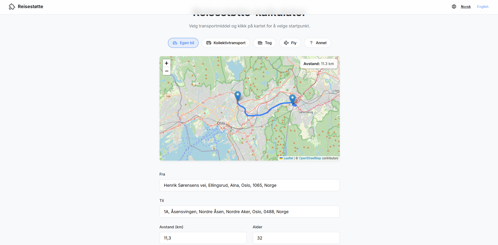
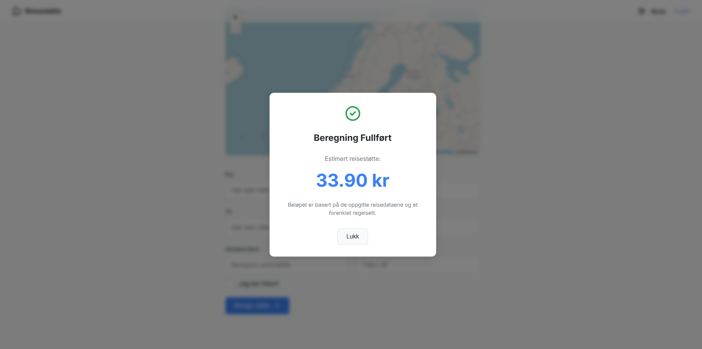

# Reisestøtte-kalkulator
[](https://github.com/martingit2/reisestotte-kalkulator/actions)

Et fullstack "Proof-of-Concept"-prosjekt bygget med Java (Spring Boot), React og Docker, med fokus på en profesjonell brukeropplevelse og skalerbar arkitektur.

Velkommen til **Reisestøtte-kalkulator**. Dette er et selvstendig læringsprosjekt designet for å demonstrere avansert teknisk kompetanse i en moderne, konteinerisert fullstack-arkitektur. Applikasjonen er ikke bare funksjonell, men også designet for å være intuitiv og brukervennlig, med interaktive elementer som live-kart og adressesøk.

---

## Innholdsfortegnelse

- [Om Prosjektet](#om-prosjektet)
  - [Formål og Kontekst](#formål-og-kontekst)
  - [Forretningslogikk](#forretningslogikk)
  - [Kjernefunksjonalitet](#kjernefunksjonalitet)
- [Teknologistack](#teknologistack)
- [Visuell Oversikt](#visuell-oversikt)
- [Arkitektur og Dataflyt](#arkitektur-og-dataflyt)
- [Komme i Gang](#komme-i-gang)
  - [Forutsetninger](#forutsetninger)
  - [Installasjon og Kjøring](#installasjon-og-kjøring)
- [Lisens](#lisens)

---

## Om Prosjektet

Dette prosjektet er en interaktiv kalkulator for å estimere økonomisk støtte til reiser, basert på et forenklet, men realistisk, regelsett.

### Formål og Kontekst

Dette er et aktivt læringsprosjekt med følgende hovedmål:

*   **Mestre en fullstack-arbeidsflyt:** Bygge og koble sammen en moderne frontend og en pålitelig backend til en sømløs applikasjon.
*   **Anvende en spesifikk teknologistack:** Implementere et system ved hjelp av Java 21, Spring Boot 3, React (med TypeScript) og MariaDB.
*   **Bygge en profesjonell brukeropplevelse (UX/UI):** Designe et grensesnitt som er rent, intuitivt og tilgjengelig, med funksjoner som internasjonalisering (i18n) og interaktive kart.
*   **Implementere robust DevOps-praksis:** Bruke **Docker** for konteinerisering, **Docker Compose** for orkestrering, og **GitHub Actions** for en automatisert CI/CD-pipeline med integrasjonstester.

### Forretningslogikk

Beregningen er basert på et forenklet regelsett inspirert av offisielle satser (per 2024), kun for demonstrasjonsformål:

*   **Standardsats:** 3,00 kr per kilometer.
*   **Egenandel:** 171,00 kr per reise.
*   **Minimumsavstand:** Reisen må være minimum 10 km.
*   **Egenandelsfritak:** Egenandelen trekkes **ikke** fra dersom pasienten er **under 16 år** eller har **frikort**.

### Kjernefunksjonalitet

*   **Interaktivt Kart:** Brukere kan klikke på et Leaflet-kart for å velge start- og sluttpunkt, og dobbelklikke for å fjerne markører.
*   **Automatisk Ruteplanlegging:** Ved valg av to punkter tegnes kjøreruten, og avstanden beregnes automatisk via OSRM API.
*   **Intelligent Adressesøk:** Skjemafeltene har "autocomplete" som gir adresseforslag via en backend-proxy til Nominatim API.
*   **Dynamisk Skjema:** Inkluderer felter for alder og frikort for nøyaktig beregning, samt en moderne, visuell velger for transportmiddel.
*   **Resultatvisning:** En elegant modal viser det beregnede støttebeløpet etter innsending.
*   **Sanntids-historikk:** En liste som automatisk oppdateres og viser de 5 siste beregningene, hentet fra databasen.
*   **Internasjonalisering (i18n):** Applikasjonen støtter både norsk og engelsk.

---

## Teknologistack

| Kategori              | Teknologi                                                              |
| --------------------- | ---------------------------------------------------------------------- |
| **Backend**           | Java 21, Spring Boot 3, Spring Data JPA, Lombok, Maven                 |
| **Frontend**          | React, TypeScript, Vite, Axios, Leaflet, `react-i18next`               |
| **Database**          | MariaDB                                                                |
| **DevOps & CI/CD**    | Docker, Docker Compose, Nginx (proxy), GitHub Actions, Testcontainers  |

---

---

## Visuell Oversikt

Applikasjonen har et rent og fokusert grensesnitt designet for enkel bruk, fra den innbydende forsiden til den detaljerte historikkvisningen.

| Clean & Intuitiv Hovedside | Persistent Historikk |
| :----------------------------------------------------------: | :----------------------------------------------------------: |
|  |  |
| Interaktiv Ruteplanlegging | Detaljvisning av Rute |
|  |  |
| Resultat (med Frikort) | Resultat (uten Frikort) |
|  |  |

---

## Arkitektur og Dataflyt

Applikasjonen er bygget på en moderne mikrotjeneste-inspirert arkitektur, orkestrert av Docker Compose.

1.  Brukeren interagerer med **React-appen**, som kjører i en Nginx-container.
2.  API-kall (både for beregning og eksterne søk) sendes til `/api/*`. Nginx fungerer som en **reverse proxy** og videresender disse kallene til backend-containeren.
3.  **Spring Boot-appen** mottar forespørselen. For adressesøk, kaller den eksterne API-er (Nominatim/OSRM). For beregninger, anvender den forretningslogikken.
4.  Data lagres og hentes fra **MariaDB-databasen**.
5.  Svaret sendes tilbake gjennom kjeden til React-appen, som oppdaterer UI-et.

---

## Komme i Gang

Hele prosjektet er designet for å kunne kjøres med én enkelt kommando.

### Forutsetninger

*   [Git](https://git-scm.com/)
*   [Docker Desktop](https://www.docker.com/products/docker-desktop/) må være installert og kjøre.

### Installasjon og Kjøring

1.  **Klone repoet:**
    ```bash
    git clone https://github.com/martingit2/reisestotte-kalkulator.git
    cd reisestotte-kalkulator
    ```

2.  **Opprett miljøfil:**
    *   Kopier `.env.example` til en ny fil som heter `.env`.
    *   Fyll inn dine egne hemmelige passord i `.env`-filen.

3.  **Bygg og start containerne:**
    ```bash
    docker-compose up --build
    ```
    *   Første gang kan dette ta noen minutter, da Docker må laste ned og bygge alt.

4.  **Applikasjonen er nå tilgjengelig:**
    *   **Frontend:** [**http://localhost:3000**](http://localhost:3000)
    *   **Backend API:** [http://localhost:8080/api/v1/history](http://localhost:8080/api/v1/history)

5.  **For å stoppe applikasjonen:**
    *   Gå til terminalen og trykk `CTRL + C`, og kjør deretter `docker-compose down`.

---

## Lisens

Distribuert under MIT-lisensen. Se `LICENSE`-filen for mer informasjon.